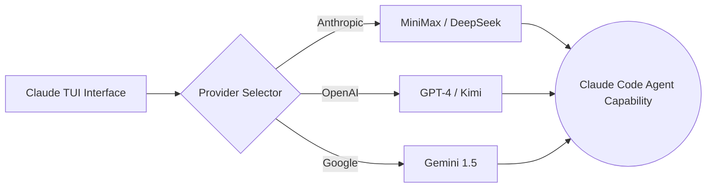

# Some one clone it

# 🚀 Claude Code Multi-Model Edition (Enhanced)

> **基于 Claude Code 源码修复的本地可运行版本 + 全能多模型接入版**

[](https://bun.sh)
[](https://www.typescriptlang.org/)
[](#-disclaimer)

本仓库提供完整的 Claude Code TUI 体验，并打破了原版的协议限制。现在，你可以通过简单的配置，让 Claude 的终端界面跑在 **GPT-4、Kimi、DeepSeek 或 MiniMax** 之上。

---

## ✨ 核心特性 (Features)

* **🖥️ 完整 TUI 体验**: 完美保留基于 `React + Ink` 的原版交互界面。
* **🤖 极速多模型支持**:
    * **Anthropic-Compatible**: 完美对接 MiniMax, DeepSeek 等。
    * **OpenAI Protocol**: 接入 GPT-4o, Kimi (Moonshot), OpenRouter。
    * **Google**: 支持 Gemini 1.5 Pro/Flash 系列。
* **🪟 Windows 双启动器**: 
    * `Claude.exe`: 原版入口。
    * `claude_rename.exe`: **增强版入口**（支持自定义 API/模型/Key）。
* **⚙️ 任意 API Base URL**: 不再受官方 Endpoint 限制，支持各种转发与中转。
* **🛠️ 鲁棒性系统**: 内置 **Recovery CLI** 模式，环境配置错误时自动降级以保证可用。

---

## 🧠 核心逻辑架构

GitHub 会自动将下面的代码渲染为流程图：



本项目基于 Claude Code 泄露源码，仅供学习研究。

---

## ⚡ 快速开始 (Quick Start)

### 1. 编译与打包
如果你需要自行构建 Windows 可执行文件：
### 1. 安装 Bun

本项目运行依赖 [Bun](https://bun.sh)。如果你的电脑还没有安装 Bun，可以先执行下面任一方式：

```bash
# macOS / Linux（官方安装脚本）
curl -fsSL https://bun.sh/install | bash
```

如果在精简版 Linux 环境里提示 `unzip is required to install bun`，先安装 `unzip`：

```bash
# Ubuntu / Debian
apt update && apt install -y unzip
```

```bash
# macOS（Homebrew）
brew install bun
```

```powershell
# Windows（PowerShell）
powershell -c "irm bun.sh/install.ps1 | iex"
```

安装完成后，重新打开终端并确认：

```bash
bun --version
```

### 2. 安装项目依赖

```bash
bun install
```
1.  **环境准备**: 确保已安装 [Bun](https://bun.sh/)。
2.  **安装依赖**: `bun install`
3.  **一键打包**: `npm run build:windows-exe`
4.  **产物路径**: `dist/Claude.exe` 和 `dist/claude_rename.exe`。

### 3. 第一次运行 (配置流)
直接运行 `claude_rename.exe`，根据提示输入：
* **Welcome name**: 你的昵称
* **API Base URL**: 接口地址 (如 `https://api.openai.com/v1`)
* **Model Name**: 模型名称 (如 `gpt-4o`)
* **API Key**: 你的私钥

---

## 📝 典型环境变量配置 (Advanced)

如果你使用 `.env` 文件进行批量部署，请参考以下配置：

### 🟢 推荐方案：MiniMax (Anthropic 协议)
```bash
HAHA_API_PROVIDER=anthropic-compatible
ANTHROPIC_BASE_URL=[https://api.minimaxi.com/anthropic](https://api.minimaxi.com/anthropic)
ANTHROPIC_API_KEY=sk-xxxxxx
ANTHROPIC_MODEL=MiniMax-M2.7-highspeed
```

### 🔵 方案二：Kimi / GPT-4 (OpenAI 协议)
```bash
HAHA_API_PROVIDER=openai
OPENAI_BASE_URL=[https://api.moonshot.cn/v1](https://api.moonshot.cn/v1)  # 或 [https://api.openai.com/v1](https://api.openai.com/v1)
OPENAI_API_KEY=sk-xxxxxx
OPENAI_MODEL=moonshot-v1-8k  # 或 gpt-4o
```

---

## 🧱 项目结构 (Project Structure)

```text
src/
├── entrypoints/    # CLI 入口与逻辑
├── components/     # UI 核心组件 (React + Ink)
├── tools/          # Agent 能力 (Bash, Edit, Grep, FileRead)
├── services/       # 服务层 (API 协议适配, MCP)
├── commands/       # 斜杠命令 (/commit, /review, /bug)
└── utils/          # 核心工具函数与常量
```

---

## 🔧 常见问题 (FAQ)

> **Q: 提示 `429 insufficient_quota`?**
> A: 你的 API 余额不足或未开启 Billing 计费，请检查服务商后台。
>
> **Q: 为什么输入 GPT 模型却报协议错误？**
> A: 请确保 `HAHA_API_PROVIDER` 设置正确。GPT 系列应使用 `openai`，而仿 Anthropic 的地址应使用 `anthropic-compatible`。
>
> **Q: EXE 运行提示找不到模块？**
> A: 本 EXE 为轻量 Launcher 模式，需保留 `node_modules` 目录及 `bun` 环境。

---

## ⚠️ 免责声明 (Disclaimer)

1. 本项目基于 2026-03-31 从 Anthropic npm registry 泄露的 Claude Code 源码进行修复与增强。
2. 所有原始代码版权均归 **Anthropic** 所有。
3. **本项目仅供学术研究、个人学习之用，严禁任何形式的商业用途。** 使用者需自行承担相关法律风险。

---

## 技术栈

| 类别 | 技术 |
|------|------|
| 运行时 | [Bun](https://bun.sh) |
| 语言 | TypeScript |
| 终端 UI | React + [Ink](https://github.com/vadimdemedes/ink) |
| CLI 解析 | Commander.js |
| API | Anthropic SDK |
| 协议 | MCP, LSP |

---

## Disclaimer

本仓库基于 2026-03-31 从 Anthropic npm registry 泄露的 Claude Code 源码。所有原始源码版权归 [Anthropic](https://www.anthropic.com) 所有。仅供学习和研究用途。


